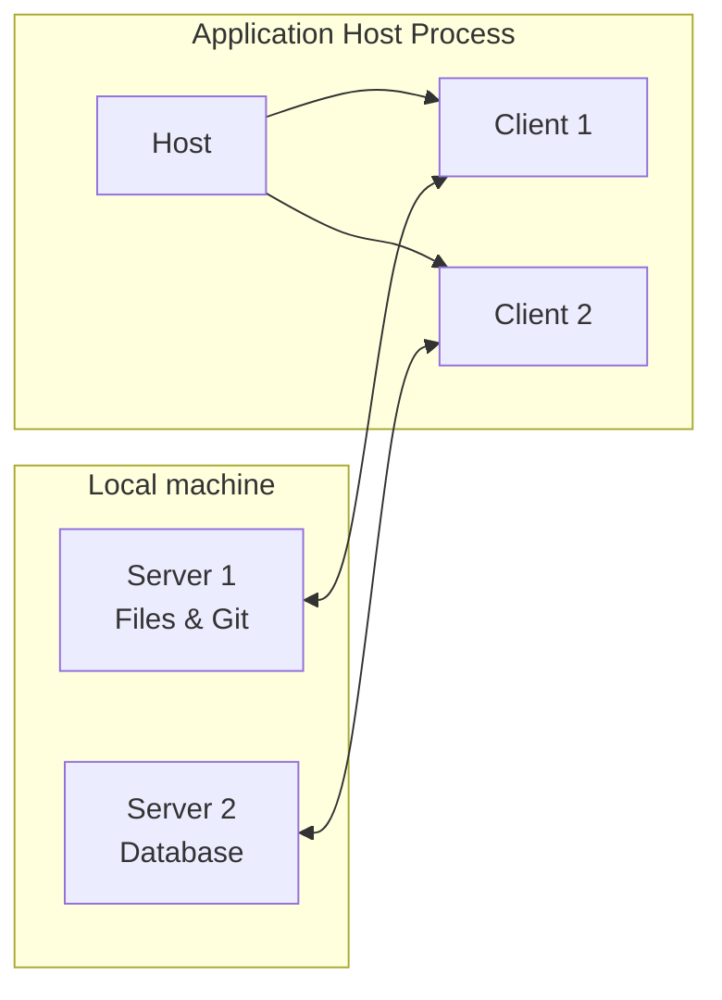
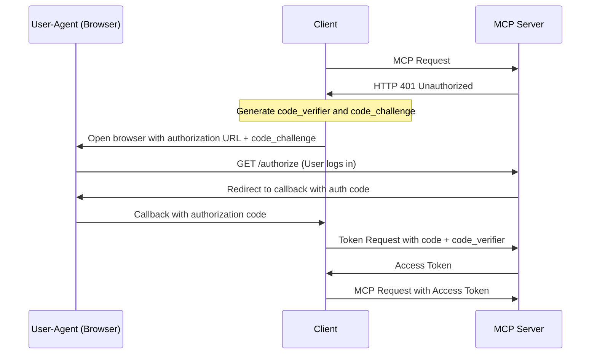

# Model Context Protocol (MCP) Specification - 2025-03-26

This document provides a consolidated, detailed specification for the Model Context Protocol (MCP), version `2025-03-26`. It is designed for consumption by both LLMs and human developers.

The key words "MUST", "MUST NOT", "REQUIRED", "SHALL", "SHALL NOT", "SHOULD", "SHOULD NOT", "RECOMMENDED", "NOT RECOMMENDED", "MAY", and "OPTIONAL" in this document are to be interpreted as described in [BCP 14](https://datatracker.ietf.org/doc/html/bcp14) (RFC2119, RFC8174) when they appear in all capitals.

The source of truth for the protocol is the TypeScript schema, from which key types are excerpted here.

## 1. Architecture

MCP follows a client-host-server architecture. A host process (e.g., an IDE or chat application) can manage multiple clients. Each client maintains a stateful, 1:1 connection with a server, enabling AI capabilities while maintaining security boundaries.

### Core Components



-   **Host**: A container process that creates, manages, and coordinates multiple client instances. It handles security, user authorization, and aggregates context.
-   **Client**: Created by the host, each client maintains an isolated, stateful session with one server. It routes protocol messages and manages its connection.
-   **Server**: Provides specialized context and capabilities (resources, tools, prompts). Servers are designed to be simple, composable, and isolated from each other.

### Design Principles

1.  **Servers are easy to build**: Hosts handle complex orchestration; servers focus on specific capabilities.
2.  **Servers are highly composable**: Focused servers can be combined seamlessly.
3.  **Servers are isolated**: Servers cannot see the full conversation or other servers' data. The host enforces security.
4.  **Progressive feature adoption**: The protocol is extensible. Core functionality is minimal, and additional capabilities are negotiated.

## 2. Core Protocol

MCP is built on JSON-RPC 2.0. All messages **MUST** follow this specification.

### 2.1. JSON-RPC Messages

Messages can be Requests, Responses, or Notifications.

-   **Request**: Initiates an operation. **MUST** include a unique `id` (string or number, not null).
    ```typescript
    {
      "jsonrpc": "2.0",
      "id": string | number,
      "method": string,
      "params"?: { [key: string]: unknown }
    }
    ```
-   **Response**: Sent for a request. **MUST** include the same `id`. **MUST** contain either `result` or `error`, but not both.
    ```typescript
    {
      "jsonrpc": "2.0",
      "id": string | number,
      "result"?: { [key: string]: unknown },
      "error"?: { code: number, message: string, data?: unknown }
    }
    ```
-   **Notification**: A one-way message. **MUST NOT** include an `id`.
    ```typescript
    {
      "jsonrpc": "2.0",
      "method": string,
      "params"?: { [key: string]: unknown }
    }
    ```
-   **Batching**: Implementations **MUST** support receiving JSON-RPC batches (an array of requests/notifications) and **MAY** support sending them.

### 2.2. Session Lifecycle

Connections have a strict lifecycle: Initialization, Operation, and Shutdown.

```mermaid
sequenceDiagram
    participant Client
    participant Server

    Note over Client,Server: Initialization Phase
    Client->>+Server: initialize request
    Server-->>Client: initialize response
    Client--)Server: initialized notification

    Note over Client,Server: Operation Phase
    rect rgb(200, 220, 250)
        note over Client,Server: Normal protocol operations
    end

    Note over Client,Server: Shutdown
    Client--)-Server: Disconnect (transport-specific)
deactivate Server
```

1.  **Initialization**: The client sends an `initialize` request with its protocol version, capabilities, and info. The server responds with its own. This is how features are negotiated.
    -   **Client `initialize` Request**:
        ```json
        {
          "jsonrpc": "2.0", "id": 1, "method": "initialize",
          "params": {
            "protocolVersion": "2025-03-26",
            "capabilities": { "sampling": {}, "roots": { "listChanged": true } },
            "clientInfo": { "name": "ExampleClient", "version": "1.0.0" }
          }
        }
        ```
    -   **Server `initialize` Response**:
        ```json
        {
          "jsonrpc": "2.0", "id": 1,
          "result": {
            "protocolVersion": "2025-03-26",
            "capabilities": { "tools": { "listChanged": true }, "resources": { "subscribe": true } },
            "serverInfo": { "name": "ExampleServer", "version": "1.0.0" }
          }
        }
        ```
    -   After a successful `initialize` exchange, the client **MUST** send an `initialized` notification.
        ```json
        { "jsonrpc": "2.0", "method": "notifications/initialized" }
        ```

2.  **Operation**: Client and server exchange messages according to negotiated capabilities.

3.  **Shutdown**: The connection is terminated using the underlying transport mechanism (e.g., closing stdin for `stdio`, closing HTTP connection).

### 2.3. Capability Negotiation

Clients and servers declare supported features in the `initialize` exchange. If a feature is not declared, it **MUST NOT** be used.

-   **Client Capabilities**: `roots`, `sampling`, `experimental`.
-   **Server Capabilities**: `prompts`, `resources`, `tools`, `logging`, `completions`, `experimental`.

## 3. Transports

MCP defines two standard transports. Messages **MUST** be UTF-8 encoded.

### 3.1. stdio

The client launches the server as a subprocess. Communication occurs over `stdin` (client to server) and `stdout` (server to client). Messages are newline-delimited JSON objects. `stderr` can be used for out-of-band logging.

### 3.2. Streamable HTTP

The server runs as an independent process with a single MCP endpoint supporting `POST` and `GET`. This transport allows for multiple client connections and streaming server-to-client messages via Server-Sent Events (SSE).

-   **Client-to-Server**: All client messages are `POST` requests to the MCP endpoint.
    -   Requests expecting a response can receive a single `application/json` response or a `text/event-stream` (SSE) for streaming multiple messages.
    -   Notifications/Responses receive a `202 Accepted`.
-   **Server-to-Client**: The client can issue a `GET` request to open a long-lived SSE stream for the server to send unsolicited requests and notifications.
-   **Session Management**: A stateful session can be managed via an `Mcp-Session-Id` HTTP header, returned by the server in the `initialize` response.
-   **Security**: Implementations **MUST** validate the `Origin` header and **SHOULD** bind to localhost for local servers to prevent DNS rebinding attacks.

## 4. Authorization (HTTP Transport)

MCP provides an **OPTIONAL** authorization framework for HTTP-based transports, based on a subset of OAuth 2.1. It is not for `stdio` transport, which should use environment credentials.

-   **Flow**: Based on OAuth 2.1, using Authorization Code Grant with PKCE.
-   **Discovery**: Clients **MUST** use OAuth 2.0 Authorization Server Metadata (`/.well-known/oauth-authorization-server`) to find endpoints. Fallback to default paths (`/authorize`, `/token`, `/register`) is required if discovery fails.
-   **Registration**: Servers **SHOULD** support OAuth 2.0 Dynamic Client Registration to allow clients to register automatically.
-   **Tokens**: Access tokens **MUST** be sent in the `Authorization: Bearer <token>` header for every HTTP request.

**Authorization Code Grant Flow:**


## 5. Server Features

Servers expose functionality through three main primitives: Resources, Tools, and Prompts.

### 5.1. Resources

Application-controlled contextual data (e.g., file contents, database schemas). Identified by a URI.

-   **Capability**: `resources`, with optional support for `subscribe` (change notifications for a single resource) and `listChanged` (notifications for the list of all resources).
-   **Messages**:
    -   `resources/list`: Lists available resources (paginated).
    -   `resources/read`: Reads the content of a resource by URI.
    -   `resources/templates/list`: Lists resource URI templates.
    -   `resources/subscribe` & `resources/unsubscribe`: Manage notifications for a resource.
    -   `notifications/resources/list_changed`: Notifies client the resource list has changed.
    -   `notifications/resources/updated`: Notifies client a subscribed resource has changed.
-   **Data Structures**:
    ```typescript
    interface Resource {
      uri: string; // e.g., 'file:///path/to/file', 'git://...'
      name: string;
      description?: string;
      mimeType?: string;
      size?: number;
    }

    interface TextResourceContents {
      uri: string;
      mimeType?: string;
      text: string;
    }

    interface BlobResourceContents {
      uri: string;
      mimeType?: string;
      blob: string; // base64-encoded
    }
    ```

### 5.2. Tools

Model-controlled functions the AI can execute (e.g., API calls, file writes).

-   **Capability**: `tools`, with optional `listChanged` support.
-   **Messages**:
    -   `tools/list`: Lists available tools (paginated).
    -   `tools/call`: Invokes a tool by name with arguments.
    -   `notifications/tools/list_changed`: Notifies client the tool list has changed.
-   **Data Structures**:
    ```typescript
    interface Tool {
      name: string;
      description?: string;
      inputSchema: {
        type: "object";
        properties?: { [key: string]: object };
        required?: string[];
      };
      annotations?: ToolAnnotations; // readOnlyHint, destructiveHint etc.
    }

    interface CallToolResult {
      content: (TextContent | ImageContent | AudioContent | EmbeddedResource)[];
      isError?: boolean; // Differentiates tool execution errors from protocol errors.
    }
    ```
-   **Security**: Tool execution is powerful. Clients **SHOULD** always get user confirmation before invoking a tool. Tool annotations from untrusted servers are hints and **MUST NOT** be trusted for security decisions.

### 5.3. Prompts

User-controlled templates for interacting with the LLM (e.g., slash commands).

-   **Capability**: `prompts`, with optional `listChanged` support.
-   **Messages**:
    -   `prompts/list`: Lists available prompt templates (paginated).
    -   `prompts/get`: Retrieves a fully-formed prompt after substituting arguments.
    -   `notifications/prompts/list_changed`: Notifies client the prompt list has changed.
-   **Data Structures**:
    ```typescript
    interface Prompt {
      name: string;
      description?: string;
      arguments?: PromptArgument[];
    }

    interface PromptMessage {
      role: "user" | "assistant";
      content: TextContent | ImageContent | AudioContent | EmbeddedResource;
    }
    ```

## 6. Client Features

Clients can offer features to servers, primarily for file access and agentic behavior.

### 6.1. Sampling

Allows a server to request an LLM completion from the client. This enables agentic loops where a tool execution might trigger another LLM call.

-   **Capability**: `sampling`.
-   **Messages**:
    -   `sampling/createMessage`: Server requests a completion, providing messages, a system prompt, and model preferences.
-   **Data Structures**:
    ```typescript
    interface CreateMessageRequest {
      method: "sampling/createMessage";
      params: {
        messages: SamplingMessage[];
        modelPreferences?: ModelPreferences;
        systemPrompt?: string;
        maxTokens: number;
        // ... and other standard LLM params
      };
    }

    interface ModelPreferences {
      hints?: { name?: string }[]; // e.g., "claude-3-sonnet"
      costPriority?: number;    // 0-1
      speedPriority?: number;   // 0-1
      intelligencePriority?: number; // 0-1
    }
    ```
-   **Security**: The client is the gatekeeper. It **SHOULD** always require human-in-the-loop approval for sampling requests to prevent unintended actions or runaway loops.

### 6.2. Roots

Allows a client to expose specific filesystem directories ("roots") to a server, defining access boundaries.

-   **Capability**: `roots`, with optional `listChanged` support.
-   **Messages**:
    -   `roots/list`: Server requests the list of root URIs from the client.
    -   `notifications/roots/list_changed`: Client notifies server that the list of roots has changed.
-   **Data Structures**:
    ```typescript
    interface Root {
      uri: string; // MUST be a `file://` URI.
      name?: string;
    }
    ```
-   **Security**: Clients **MUST** only expose roots with user consent and **MUST** validate URIs to prevent path traversal attacks.

## 7. Utilities

MCP includes several optional utilities for cross-cutting concerns.

-   **Pagination**: List operations (`resources/list`, `tools/list`, etc.) support cursor-based pagination. A response with a `nextCursor` token indicates more results are available. The client sends this token in the next request to get the following page.
-   **Cancellation**: A `notifications/cancelled` notification can be sent to attempt to cancel a long-running request. The `requestId` of the original request is included. Cancellation is best-effort.
-   **Progress**: A request can include a `progressToken` in its `_meta` field. The receiver can then send `notifications/progress` notifications with updates (e.g., `{ "progress": 50, "total": 100, "message": "Processing..." }`).
-   **Logging**: A server with the `logging` capability can send `notifications/message` notifications. The client can use `logging/setLevel` to control verbosity. Log levels are standard syslog levels (`debug`, `info`, `error`, etc.).
-   **Ping**: A `ping` request can be sent by either party to check if the connection is alive. The receiver **MUST** promptly send an empty success response.
-   **Completion**: A server with the `completions` capability can provide argument autocompletion for prompts and resource templates via the `completion/complete` request.

## 8. Key Data Content Types

Messages in prompts, tool results, and sampling can contain various content types.

```typescript
// For text content
interface TextContent {
  type: "text";
  text: string;
}

// For image content
interface ImageContent {
  type: "image";
  data: string; // base64-encoded image
  mimeType: string; // e.g., "image/png"
}

// For audio content
interface AudioContent {
  type: "audio";
  data: string; // base64-encoded audio
  mimeType: string; // e.g., "audio/wav"
}

// For embedding a server-side resource
interface EmbeddedResource {
  type: "resource";
  resource: TextResourceContents | BlobResourceContents;
}
```
